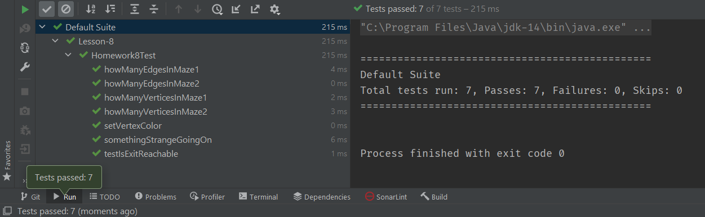

## Data Structures and Algorithms in Java (CSE-41321)
## University of California San Diego Extension
## Summer 2021 (157162)
## Raymond Mitchell III (Instructor)
## Assignment #8
### Graphs
### Problem Statement
In this assignment we were asked to write an algorithm that determines whether there is a path through a maze.
A maze will be represented as an undirected graph with each room represented as a vertex and each corridor represented
as a pair of edges. Each room will be uniquely identified by a single character label.

Here are two sample mazes that will be used to test the implementation:

   

Notice that maze #1 has a path from the entrance to exit, but maze #2 does not. When properly implemented, the algorithm
should succeed (i.e., find the exit) when applied to maze #1, but fail (i.e., not find the exit) when applied to maze #2.

The method implemented must be a Boolean function that will return _true_ when a path from the entrance to the exit
exists, or _false_ when one does not. The signature of the method is as follows:
```java
public static boolean isExitReachable(Graph maze, char entrance, char exit)
```
The first argument is a **Graph** containing the representation of the maze to be searched. The second argument
is a **char**acter representing the entrance to the maze. The second argument is a **char**acter representing the exit
to the maze. This method will return true when it succeeds in finding a path between the entrance and the exit of the
maze, otherwise it will return false.
### Solution
The maze in this exercise is modeled as a graph using adjacency-list representation. The classes comprising the library
were provided courtesy of the instructor (Raymond Mitchell III) and are being reused with his permission. I was hoping
to avoid making any changes to the existing code, but I did add a **VertexColor** field to the **Vertex** class.

For this exercise I chose to implement an iterative (as opposed to recursive) version of a depth-first-search
algorithm. The Java source for that implementation is as follows:
```java
    public static boolean isExitReachable(Graph maze, char entrance, char exit) {
        Stack<Graph.Vertex> stack = new Stack<Graph.Vertex>();
        Graph.Vertex start = maze.getVertex(entrance);
        stack.push(start);
        while (!stack.isEmpty()) {
            Graph.Vertex current = stack.pop();
            current.setColor(VertexColor.GRAY);
            if (Character.compare((char) current.getData(), exit) == 0) return true;
            for (Object object : current.edgesIncidentFrom) {
                Graph.Edge next = (Graph.Edge) object;
                Graph.Vertex destination = next.getTo();
                if (destination.getColor().compareTo(VertexColor.GRAY) != 0) {
                    stack.push(destination);
                }
            }
        }
        return false;
    }
```
### Implementation
#### Homework8.java
```java
package cse41321.container;

import java.util.Iterator;
import java.util.NoSuchElementException;
import java.util.Stack;

import static com.google.common.base.Preconditions.checkNotNull;
import static com.google.common.base.Preconditions.checkState;

public class Homework8 {

    public enum VertexColor {
        WHITE,
        GRAY,
        BLACK
    }

    public static class KeyValuePair<K, V> {
        private K key;
        private V value;

        public KeyValuePair(K key, V value) {
            this.key = key;
            this.value = value;
        }

        public K getKey() {
            return key;
        }

        public V getValue() {
            return value;
        }
    }

    public static class SinglyLinkedList<E> {
        // An element in a linked list
        public class Element {
            private E data;
            private Element next;

            // Only allow SinglyLinkedList to construct Elements
            private Element(E data) {
                this.data = data;
                this.next = null;
            }

            public E getData() {
                return data;
            }

            public Element getNext() {
                return next;
            }

            private SinglyLinkedList getOwner() {
                return SinglyLinkedList.this;
            }
        }

        private Element head;
        private Element tail;
        private int size;

        public Element getHead() {
            return head;
        }

        public Element getTail() {
            return tail;
        }

        public int getSize() {
            return size;
        }

        public boolean isEmpty() {
            return size == 0;
        }

        public Element insertHead(E data) {
            Element newElement = new Element(data);

            if (isEmpty()) {
                // Insert into empty list
                head = newElement;
                tail = newElement;
            } else {
                // Insert into non-empty list
                newElement.next = head;
                head = newElement;
            }

            ++size;

            return newElement;
        }

        public Element insertTail(E data) {
            Element newElement = new Element(data);

            if (isEmpty()) {
                // Insert into empty list
                head = newElement;
                tail = newElement;
            } else {
                // Insert into non-empty list
                tail.next = newElement;
                tail = newElement;
            }

            ++size;

            return newElement;
        }

        public Element insertAfter(Element element, E data)
                throws IllegalArgumentException {
            // Check pre-conditions
            if (element == null) {
                throw new IllegalArgumentException(
                        "Argument 'element' must not be null");
            }
            if (element.getOwner() != this) {
                throw new IllegalArgumentException(
                        "Argument 'element' does not belong to this list");
            }

            // Insert new element
            Element newElement = new Element(data);
            if (tail == element) {
                // Insert new tail
                element.next = newElement;
                tail = newElement;
            } else {
                // Insert into middle of list
                newElement.next = element.next;
                element.next = newElement;
            }

            ++size;

            return newElement;
        }

        public E removeHead() throws NoSuchElementException {
            // Check pre-conditions
            if (isEmpty()) {
                throw new NoSuchElementException("Cannot remove from empty list");
            }

            // Remove the head
            Element oldHead = head;
            if (size == 1) {
                // Handle removal of the last element
                head = null;
                tail = null;
            } else {
                head = head.next;
            }

            --size;

            return oldHead.data;
        }

        // Note that there is no removeTail.  This cannot be implemented
        // efficiently because it would require O(n) to scan from head until
        // reaching the item _before_ tail.

        public E removeAfter(Element element)
                throws IllegalArgumentException, NoSuchElementException {
            // Check pre-conditions
            if (element == null) {
                throw new IllegalArgumentException(
                        "Argument 'element' must not be null");
            }
            if (element.getOwner() != this) {
                throw new IllegalArgumentException(
                        "Argument 'element' does not belong to this list");
            }
            if (element == tail) {
                throw new IllegalArgumentException(
                        "Argument 'element' must have a non-null next element");
            }

            // Remove element
            Element elementToRemove = element.next;
            if (elementToRemove == tail) {
                // Remove the tail
                element.next = null;
                tail = element;
            } else {
                // Remove from middle of list
                element.next = elementToRemove.next;
            }

            --size;

            return elementToRemove.data;
        }

        @Override
        public boolean equals(Object o) {
            if (this == o) return true;
            if (o == null || getClass() != o.getClass()) return false;

            SinglyLinkedList<?> that = (SinglyLinkedList<?>) o;

            if (this.size != that.size) return false;

            // Return whether all elements are the same
            SinglyLinkedList<?>.Element thisElem = this.getHead();
            SinglyLinkedList<?>.Element thatElem = that.getHead();
            while (thisElem != null && thatElem != null) {
                if (!thisElem.getData().equals(thatElem.getData())) {
                    return false;
                }
                thisElem = thisElem.getNext();
                thatElem = thatElem.getNext();
            }

            return true;
        }
    }

    public static class ChainedHashTable<K, V> {
        // Table of buckets
        private SinglyLinkedList<KeyValuePair<K, V>>[] table;

        private int size;

        public ChainedHashTable() {
            this(997);  // A prime number of buckets
        }

        @SuppressWarnings("unchecked")
        public ChainedHashTable(int buckets) {
            // Create table of empty buckets
            table = new SinglyLinkedList[buckets];
            for (int i = 0; i < table.length; ++i) {
                table[i] = new SinglyLinkedList<KeyValuePair<K, V>>();
            }

            size = 0;
        }

        public int getSize() {
            return size;
        }

        public boolean isEmpty() {
            return getSize() == 0;
        }

        public void insert(K key, V value) throws
                IllegalArgumentException,
                DuplicateKeyException {
            if (key == null) {
                throw new IllegalArgumentException("key must not be null");
            }
            if (contains(key)) {
                throw new DuplicateKeyException();
            }

            getBucket(key).insertHead(new KeyValuePair<K, V>(key, value));
            ++size;
        }

        public V remove(K key) throws
                IllegalArgumentException,
                NoSuchElementException {
            if (key == null) {
                throw new IllegalArgumentException("key must not be null");
            }

            // If empty bucket
            SinglyLinkedList<KeyValuePair<K, V>> bucket = getBucket(key);
            if (bucket.isEmpty()) {
                throw new NoSuchElementException();
            }

            // If at head of bucket
            SinglyLinkedList<KeyValuePair<K, V>>.Element elem = bucket.getHead();
            if (key.equals(elem.getData().getKey())) {
                --size;
                return bucket.removeHead().getValue();
            }

            // Scan rest of bucket
            SinglyLinkedList<KeyValuePair<K, V>>.Element prev = elem;
            elem = elem.getNext();
            while (elem != null) {
                if (key.equals(elem.getData().getKey())) {
                    --size;
                    return bucket.removeAfter(prev).getValue();
                }
                prev = elem;
                elem = elem.getNext();
            }

            throw new NoSuchElementException();
        }

        public V lookup(K key) throws
                IllegalArgumentException,
                NoSuchElementException {
            if (key == null) {
                throw new IllegalArgumentException("key must not be null");
            }

            // Scan bucket for key
            SinglyLinkedList<KeyValuePair<K, V>>.Element elem =
                    getBucket(key).getHead();
            while (elem != null) {
                if (key.equals(elem.getData().getKey())) {
                    return elem.getData().getValue();
                }
                elem = elem.getNext();
            }

            throw new NoSuchElementException();
        }

        public boolean contains(K key) {
            try {
                lookup(key);
            } catch (IllegalArgumentException ex) {
                return false;
            } catch (NoSuchElementException ex) {
                return false;
            }

            return true;
        }

        private SinglyLinkedList<KeyValuePair<K, V>> getBucket(K key) {
            // Division method
            return table[Math.abs(key.hashCode()) % table.length];
        }

        private class KeysIterator implements Iterator<K> {
            private int remaining;  // Number of keys remaining to iterate
            private int bucket;     // Bucket we're iterating
            private SinglyLinkedList<KeyValuePair<K, V>>.Element elem;
            // Position in bucket we're iterating

            public KeysIterator() {
                remaining = ChainedHashTable.this.size;
                bucket = 0;
                elem = ChainedHashTable.this.table[bucket].getHead();
            }

            public boolean hasNext() {
                return remaining > 0;
            }

            public K next() {
                if (hasNext()) {
                    // If we've hit end of bucket, move to next non-empty bucket
                    while (elem == null) {
                        elem = ChainedHashTable.this.table[++bucket].getHead();
                    }

                    // Get key
                    K key = elem.getData().getKey();

                    // Move to next element and decrement entries remaining
                    elem = elem.getNext();
                    --remaining;

                    return key;
                } else {
                    throw new NoSuchElementException();
                }
            }
        }

        public Iterable<K> keys() {
            return new Iterable<K>() {
                public Iterator<K> iterator() {
                    return new KeysIterator();
                }
            };
        }
    }


    /**
     * Adjacency list representation of a graph.
     *
     * @param <V> Data type stored in each vertex.
     * @param <E> Data type stored in each edge.
     */
    public static class Graph<V, E> {

        public class Vertex {
            private V data;
            private HashSet<Edge> edgesIncidentFrom = new HashSet<Edge>();
            private HashSet<Edge> edgesIncidentTo = new HashSet<Edge>();
            private VertexColor color = VertexColor.WHITE;

            public VertexColor getColor() {
                return color;
            }

            public void setColor(VertexColor color) {
                this.color = color;
            }


            private Vertex(V data) {
                this.data = data;
            }

            public V getData() {
                return data;
            }

            public Iterable<Edge> getEdgesIncidentFrom() {
                return new Iterable<Edge>() {
                    public Iterator<Edge> iterator() {
                        return edgesIncidentFrom.iterator();
                    }
                };
            }

            public Iterable<Edge> getEdgesIncidentTo() {
                return new Iterable<Edge>() {
                    public Iterator<Edge> iterator() {
                        return edgesIncidentTo.iterator();
                    }
                };
            }

            @Override
            @SuppressWarnings("unchecked")
            public boolean equals(Object o) {
                if (this == o) return true;
                if (o == null || getClass() != o.getClass()) return false;

                Vertex vertex = (Vertex) o;

                return data.equals(vertex.data);
            }

            @Override
            public int hashCode() {
                return data.hashCode();
            }
        }

        public class Edge {
            private Vertex from;
            private Vertex to;
            private E data;

            private Edge(Vertex from, Vertex to) {
                this(from, to, null);
            }

            private Edge(Vertex from, Vertex to, E data) {
                this.from = from;
                this.to = to;
                this.data = data;
            }

            public Vertex getFrom() {
                return from;
            }

            public Vertex getTo() {
                return to;
            }

            public E getData() {
                return data;
            }

            @Override
            @SuppressWarnings("unchecked")
            public boolean equals(Object o) {
                if (this == o) return true;
                if (o == null || getClass() != o.getClass()) return false;

                Edge edge = (Edge) o;

                return from.equals(edge.from) && to.equals(edge.to);
            }

            @Override
            public int hashCode() {
                int result = from.hashCode();
                result = 31 * result + to.hashCode();
                return result;
            }
        }

        private HashSet<Vertex> vertices = new HashSet<Vertex>();

        private HashSet<Edge> edges = new HashSet<Edge>();

        // ============================ Vertex methods ============================
        public boolean containsVertex(V data) {
            return vertices.isMember(new Vertex(data));
        }

        public int getNumVertices() {
            return vertices.getSize();
        }

        public Iterable<Vertex> getVertices() {
            return new Iterable<Vertex>() {
                public Iterator<Vertex> iterator() {
                    return vertices.iterator();
                }
            };
        }

        public Vertex getVertex(V data) throws
                NullPointerException,
                IllegalStateException {
            // Preconditions
            checkVertexPreconditions(data);
            checkState(containsVertex(data), "Vertex does not exist");

            return vertices.getMember(new Vertex(data));
        }

        public void insertVertex(V data) throws
                NullPointerException,
                IllegalStateException {
            // Preconditions
            checkVertexPreconditions(data);
            checkState(!containsVertex(data), "Vertex already exists");

            vertices.insert(new Vertex(data));
        }

        public V removeVertex(V data) throws
                NullPointerException,
                IllegalStateException {
            // Preconditions
            checkVertexPreconditions(data);
            checkState(containsVertex(data), "Vertex does not exist");
            Vertex vertex = vertices.getMember(new Vertex(data));
            checkState(vertex.edgesIncidentFrom.isEmpty(),
                    "Vertex has edges incident from it");
            checkState(vertex.edgesIncidentTo.isEmpty(),
                    "Vertex has edges incident to it");

            return vertices.remove(new Vertex(data)).data;
        }

        private void checkVertexPreconditions(V data) throws
                NullPointerException {
            checkNotNull(data, "data must not be null");
        }

        // ============================= Edge methods =============================
        public boolean containsEdge(V from, V to) {
            return from != null
                    && to != null
                    && containsVertex(from)
                    && containsVertex(to)
                    && edges.isMember(new Edge(getVertex(from), getVertex(to)));
        }

        public int getNumEdges() {
            return edges.getSize();
        }

        public Iterable<Edge> getEdges() {
            return new Iterable<Edge>() {
                public Iterator<Edge> iterator() {
                    return edges.iterator();
                }
            };
        }

        public Edge getEdge(V from, V to) throws
                NullPointerException,
                IllegalStateException {
            // Preconditions
            checkEdgePreconditions(from, to);
            checkState(containsEdge(from, to), "Edge does not exist");

            return edges.getMember(new Edge(getVertex(from), getVertex(to)));
        }

        public void insertEdge(V from, V to, E data) throws
                NullPointerException,
                IllegalStateException {
            // Preconditions
            checkEdgePreconditions(from, to);
            checkState(!containsEdge(from, to), "Edge already exists");

            // Add to graph's edge set
            Vertex fromVertex = getVertex(from);
            Vertex toVertex = getVertex(to);
            Edge edge = new Edge(fromVertex, toVertex, data);
            edges.insert(edge);

            // Add to "from" vertex's incidence set
            fromVertex.edgesIncidentFrom.insert(edge);

            // Add to "to" vertex's incidence set
            toVertex.edgesIncidentTo.insert(edge);
        }

        public E removeEdge(V from, V to) throws
                NullPointerException,
                IllegalStateException {
            // Preconditions
            checkEdgePreconditions(from, to);
            checkState(containsEdge(from, to), "Edge does not exist");

            // Remove edge from graph's edge set
            Vertex fromVertex = getVertex(from);
            Vertex toVertex = getVertex(to);
            Edge edge = new Edge(fromVertex, toVertex);
            E data = edges.remove(edge).data;

            // Remove edge from "from" vertex's incidence set
            fromVertex.edgesIncidentFrom.remove(edge);

            // Remove edge from "to" vertex's incidence set
            toVertex.edgesIncidentTo.remove(edge);

            return data;
        }

        private void checkEdgePreconditions(V from, V to) throws
                NullPointerException,
                IllegalStateException {
            checkNotNull(from, "from must not be null");
            checkNotNull(to, "to must not be null");
            checkState(containsVertex(from), "from vertex does not exist");
            checkState(containsVertex(to), "to vertex does not exist");
        }
    }

    // Extends RuntimeException instead of Exception since that's the
    // convention set by NoSuchElementException.
    public static class DuplicateElementException extends RuntimeException {
        public DuplicateElementException() {
        }

        public DuplicateElementException(String message) {
            super(message);
        }

        public DuplicateElementException(Throwable cause) {
            super(cause);
        }

        public DuplicateElementException(String message, Throwable cause) {
            super(message, cause);
        }
    }

    // Extends RuntimeException instead of Exception since that's the
    // convention set by NoSuchElementException.
    public static class DuplicateKeyException extends RuntimeException {
        public DuplicateKeyException() {
        }

        public DuplicateKeyException(String message) {
            super(message);
        }

        public DuplicateKeyException(Throwable cause) {
            super(cause);
        }

        public DuplicateKeyException(String message, Throwable cause) {
            super(message, cause);
        }
    }

    public static class HashSet<E> implements Iterable<E> {
        private ChainedHashTable<E, E> table;

        public HashSet() {
            this(997);  // A prime number of buckets
        }

        public HashSet(int buckets) {
            table = new ChainedHashTable<E, E>(buckets);
        }

        public int getSize() {
            return table.getSize();
        }

        public boolean isEmpty() {
            return table.isEmpty();
        }

        public void insert(E data) throws
                IllegalArgumentException,
                DuplicateElementException {
            if (data == null) {
                throw new IllegalArgumentException("data must not be null");
            }

            // Insert data into the table
            try {
                table.insert(data, data);
            } catch (DuplicateKeyException ex) {
                throw new DuplicateElementException();
            }
        }

        public E remove(E data) throws
                IllegalArgumentException,
                NoSuchElementException {
            if (data == null) {
                throw new IllegalArgumentException("data must not be null");
            }

            return table.remove(data);
        }

        public boolean isMember(E data) throws
                IllegalArgumentException {
            if (data == null) {
                throw new IllegalArgumentException("data must not be null");
            }

            return table.contains(data);
        }

        public E getMember(E data) throws
                IllegalArgumentException {
            if (data == null) {
                throw new IllegalArgumentException("data must not be null");
            }

            return table.lookup(data);
        }


        public HashSet<E> union(HashSet<E> other) throws
                IllegalArgumentException {
            if (other == null) {
                throw new IllegalArgumentException("other must not be null");
            }

            HashSet<E> result = new HashSet<E>(getSize() + other.getSize());

            // Add all items from this
            for (E data : this) {
                try {
                    result.insert(data);
                } catch (DuplicateElementException ex) {
                    // Ignore duplicate failures
                }
            }

            // Add all items from other
            for (E data : other) {
                try {
                    result.insert(data);
                } catch (DuplicateElementException ex) {
                    // Ignore duplicate failures
                }
            }

            return result;
        }

        public HashSet<E> intersection(HashSet<E> other) throws
                IllegalArgumentException {
            if (other == null) {
                throw new IllegalArgumentException("other must not be null");
            }

            HashSet<E> result = new HashSet<E>(getSize() + other.getSize());

            // Add elements from this that are in other
            for (E data : this) {
                if (other.isMember(data)) {
                    try {
                        result.insert(data);
                    } catch (DuplicateElementException ex) {
                        // Ignore duplicate failures
                    }
                }
            }

            return result;
        }

        public HashSet<E> difference(HashSet<E> other) throws
                IllegalArgumentException {
            if (other == null) {
                throw new IllegalArgumentException("other must not be null");
            }

            HashSet<E> result = new HashSet<E>(getSize() + other.getSize());

            // Add elements from this that are not in other
            for (E data : this) {
                if (!other.isMember(data)) {
                    try {
                        result.insert(data);
                    } catch (DuplicateElementException ex) {
                        // Ignore duplicate failures
                    }
                }
            }

            return result;
        }

        public boolean isSubset(HashSet<E> other) throws
                IllegalArgumentException {
            if (other == null) {
                throw new IllegalArgumentException("other must not be null");
            }

            // If this has more elements than other, this can't be a subset
            if (getSize() > other.getSize()) {
                return false;
            }

            // If any member in this is not in other, this is not a subset
            for (E data : this) {
                if (!other.isMember(data)) {
                    return false;
                }
            }

            return true;
        }

        @Override
        @SuppressWarnings("unchecked")
        public boolean equals(Object o) {
            if (this == o)
                return true;
            if (!(o instanceof HashSet))
                return false;

            HashSet<E> other = (HashSet<E>) o;

            // If sets equal size and one is subset of other, then they're equal
            return getSize() == other.getSize()
                    && isSubset(other);
        }

        public Iterator<E> iterator() {
            return table.keys().iterator();
        }

    }

    public static boolean isExitReachable(Graph maze, char entrance, char exit) {
        Stack<Graph.Vertex> stack = new Stack<Graph.Vertex>();
        Graph.Vertex start = maze.getVertex(entrance);
        stack.push(start);
        while (!stack.isEmpty()) {
            Graph.Vertex current = stack.pop();
            current.setColor(VertexColor.GRAY);
            if (Character.compare((char) current.getData(), exit) == 0) return true;
            for (Object object : current.edgesIncidentFrom) {
                Graph.Edge next = (Graph.Edge) object;
                Graph.Vertex destination = next.getTo();
                if (destination.getColor().compareTo(VertexColor.GRAY) != 0) {
                    stack.push(destination);
                }
            }
        }
        return false;
    }

    public static class Driver {

        public static void main(String[] arguments) {
            Homework8.Graph<Character, Integer> maze1;
            Homework8.Graph<Character, Integer> maze2;
            // Maze #1
            maze1 = new Homework8.Graph<Character, Integer>();
            maze1.insertVertex('A');
            maze1.insertVertex('B');
            maze1.insertVertex('C');
            maze1.insertVertex('D');
            maze1.insertVertex('E');
            maze1.insertVertex('F');
            maze1.insertVertex('G');
            maze1.insertEdge('A', 'C', 0);
            maze1.insertEdge('C', 'A', 0);
            maze1.insertEdge('A', 'D', 0);
            maze1.insertEdge('D', 'A', 0);
            maze1.insertEdge('B', 'D', 0);
            maze1.insertEdge('D', 'B', 0);
            maze1.insertEdge('C', 'F', 0);
            maze1.insertEdge('F', 'C', 0);
            maze1.insertEdge('D', 'E', 0);
            maze1.insertEdge('D', 'G', 0);
            maze1.insertEdge('E', 'D', 0);
            maze1.insertEdge('G', 'D', 0);
            maze1.insertEdge('E', 'G', 0);
            maze1.insertEdge('G', 'E', 0);
            maze1.insertEdge('F', 'G', 0);
            maze1.insertEdge('G', 'F', 0);
            // Maze #2
            maze2 = new Homework8.Graph<Character, Integer>();
            maze2.insertVertex('A');
            maze2.insertVertex('B');
            maze2.insertVertex('C');
            maze2.insertVertex('D');
            maze2.insertVertex('E');
            maze2.insertVertex('F');
            maze2.insertVertex('G');
            maze2.insertEdge('A', 'C', 0);
            maze2.insertEdge('C', 'A', 0);
            maze2.insertEdge('A', 'D', 0);
            maze2.insertEdge('D', 'A', 0);
            maze2.insertEdge('B', 'D', 0);
            maze2.insertEdge('D', 'B', 0);
            maze2.insertEdge('C', 'F', 0);
            maze2.insertEdge('F', 'C', 0);
            maze2.insertEdge('E', 'G', 0);
            maze2.insertEdge('G', 'E', 0);
            if (isExitReachable(maze1, 'A', 'G')) {
                System.out.println("The exit in maze #1 is reachable!");
            } else {
                System.out.println("The exit in maze #1 is unreachable!");
            }
            if (isExitReachable(maze2, 'A', 'G')) {
                System.out.println("The exit in maze #2 is reachable!");
            } else {
                System.out.println("The exit in maze #2 is unreachable!");
            }
        }
    }
}

```
#### Homework8Test.java
```java
package cse41321.container;

import org.testng.annotations.AfterMethod;
import org.testng.annotations.BeforeMethod;
import org.testng.annotations.Test;

import static org.testng.Assert.assertFalse;
import static org.testng.Assert.assertTrue;
import static org.testng.AssertJUnit.assertEquals;

public class Homework8Test {

    private Homework8.Graph<Character, Integer> maze1;
    private Homework8.Graph<Character, Integer> maze2;

    @BeforeMethod
    public void setUp() {
        // Maze #1
        maze1 = new Homework8.Graph<Character, Integer>();
        maze1.insertVertex('A');
        maze1.insertVertex('B');
        maze1.insertVertex('C');
        maze1.insertVertex('D');
        maze1.insertVertex('E');
        maze1.insertVertex('F');
        maze1.insertVertex('G');
        maze1.insertEdge('A', 'C', 0);
        maze1.insertEdge('C', 'A', 0);
        maze1.insertEdge('A', 'D', 0);
        maze1.insertEdge('D', 'A', 0);
        maze1.insertEdge('B', 'D', 0);
        maze1.insertEdge('D', 'B', 0);
        maze1.insertEdge('C', 'F', 0);
        maze1.insertEdge('F', 'C', 0);
        maze1.insertEdge('D', 'E', 0);
        maze1.insertEdge('D', 'G', 0);
        maze1.insertEdge('E', 'D', 0);
        maze1.insertEdge('G', 'D', 0);
        maze1.insertEdge('E', 'G', 0);
        maze1.insertEdge('G', 'E', 0);
        maze1.insertEdge('F', 'G', 0);
        maze1.insertEdge('G', 'F', 0);
        // Maze #2
        maze2 = new Homework8.Graph<Character, Integer>();
        maze2.insertVertex('A');
        maze2.insertVertex('B');
        maze2.insertVertex('C');
        maze2.insertVertex('D');
        maze2.insertVertex('E');
        maze2.insertVertex('F');
        maze2.insertVertex('G');
        maze2.insertEdge('A', 'C', 0);
        maze2.insertEdge('C', 'A', 0);
        maze2.insertEdge('A', 'D', 0);
        maze2.insertEdge('D', 'A', 0);
        maze2.insertEdge('B', 'D', 0);
        maze2.insertEdge('D', 'B', 0);
        maze2.insertEdge('C', 'F', 0);
        maze2.insertEdge('F', 'C', 0);
        maze2.insertEdge('E', 'G', 0);
        maze2.insertEdge('G', 'E', 0);
    }

    @AfterMethod
    public void tearDown() {
    }

    @Test
    public void howManyVerticesInMaze1() {
        assertEquals(7, maze1.getNumVertices());
        maze1.removeEdge('E', 'D');
        maze1.removeEdge('D', 'E');
        maze1.removeEdge('E', 'G');
        maze1.removeEdge('G', 'E');
        maze1.removeVertex('E');
        assertEquals(6, maze1.getNumVertices());
    }

    @Test
    public void howManyEdgesInMaze1() {
        assertEquals(16, maze1.getNumEdges());
    }

    @Test
    public void howManyVerticesInMaze2() {
        assertEquals(7, maze2.getNumVertices());
        maze2.removeEdge('E', 'G');
        maze2.removeEdge('G', 'E');
        maze2.removeVertex('E');
        assertEquals(6, maze2.getNumVertices());
    }

    @Test
    public void howManyEdgesInMaze2() {
        assertEquals(10, maze2.getNumEdges());
    }

    @Test
    public void setVertexColor() {
        Homework8.Graph.Vertex vertex;
        vertex = maze1.getVertex('A');
        vertex.setColor(Homework8.VertexColor.GRAY);
        assertEquals(Homework8.VertexColor.GRAY, maze1.getVertex('A').getColor());
        assertEquals(Homework8.VertexColor.WHITE, maze1.getVertex('G').getColor());
    }

    @Test
    public void testIsExitReachable() {
        assertTrue(Homework8.isExitReachable(maze1, 'A', 'G'));
        assertFalse(Homework8.isExitReachable(maze2, 'A', 'G'));
    }

    @Test
    public void somethingStrangeGoingOn() {
        // I'm not sure what's going on, but when I add the following statements
        // to the testIsExitReachable method above, that test fails.
        assertTrue(Homework8.isExitReachable(maze1, 'C', 'G'));
        assertTrue(Homework8.isExitReachable(maze2, 'E', 'G'));
    }
}
```
### Unit Tests

### Demo
```text
The exit in maze #1 is reachable!
The exit in maze #2 is unreachable!

Process finished with exit code 0
```
### Summary
Yikes! This was scary! I wasn't sure I was going to be able to pull this one off. I'm not sure why I had so much
difficulty implementing the depth-first-search method. So far, the graph _is_ the most complicated structure that I've
seen. I almost gave up, but I'm glad I stuck with it.
